C语言程序设计(胡船长)笔记

# 1.数学运算

**左值 右值**

|       运算符       |          说明          |       例子       |
| :----------------: | :--------------------: | :--------------: |
|         =          |       赋值运算符       |      a = b;      |
| +   -   *   /   () |      基本四则运算      | a = (b + c) * d; |
|         %          |       求余运算符       |    a = b % 2;    |
|   &   \|   ^   ~   | 位运算(非常重要的一类) |   a = ~b \| c;   |
|      <<   >>       |       左移和右移       |   a = b >> 2;    |

**负数右移最大能得到负一**!

## C语言中的数学函数库

头文件：math.h

|     常用函数     |   常用函数   |
| :--------------: | :----------: |
|    pow(a, n)     |   fabs(n)    |
|     sqrt(n)      |    log(n)    |
|     ceil(n)      |   log10(n)   |
|     floor(n)     |   acos(n)    |
| abs(n)(stdlib.h) | ............ |


### C语言引入数学函数库<math.h>注意事项

若C语言代码中引入了<math.h>函数库，在终端下无法被编译

解决方法：须在编译命令后面加“-lm”；

例如：gcc daima.c -lm                  编译完成；

### 赋值运算符“=”

1.自增自减只能用在变量上，不能用在常量上

代码执行到下一行 值还存在 说明这个值是一个左值，反之不存在了为右值

“d + e”在这里为一个临时变量，默认为右值；

左值和右值不是靠放在左面或者放在右边来区分的


### 运算符优先级

说明：

同一优先级的运算符，结合次序由结合方向所决定。

简单记就是：

！(条件运算符) > 算术运算符 > 关系运算符(与或) > && > || > 赋值运算符

### “异或”运算

异或运算可用来进行位运算中的奇偶判断

例1 ^ 1 = 1       1 ^ 0 = 0	0 ^ 0 = 1（有偶数个1值为1，有奇数个1值为0）

异或运算，若c = a ^ b，那么： a = b ^ c, b = a ^ c;

代码如下

此为运行结果

### “与”“或”运算（“&”“|”运算）

**与运算通常当作位运算中的乘法**

**或运算通常当作位运算中的加法**


------


## 练习：C语言输出X的立方根

请写一个程序，输入一个数字x，输出数字x的立方根

```c
#include <stdio.h>
#include <math.h>

int main(){
    double x;
    scanf("%lf", &x);
    printf("%lf", pow(x, 1.0 / 3.0));
    return 0;
}
```


------

------


## 练习：C语言角度值转为弧度值

1.写一个程序，读如一个角度值，将角度值转为弧度值：

```c
#include <stdio.h>
#include <math.h>

#define PI acos(-1)
int main() {
	double x;
	scanf("%lf", &x);
	printf("%lf", PI / 180.0 * x);
	return 0;
}
```


------

------

------


# 2.<inttypes.h>函数库

在<inttypes.h>函数库中，定义16位参数a一般使用“int16_t a"

但是输入如果用“%d”占位，在C语言中默认是读入32位整型，编译会遇到错误，

因此我们在这里可以用到   “%PRId16”  或   “%”PRId16    这两个占位方式

如：scanf ("%PRId16", &a );

	scanf ("%"PRId16, &a);


### 输出16进制


### 输出64位整型的极小值

（极大值需要将这里MIN换成MAX）


------

------

------


# 3.程序流程控制方法

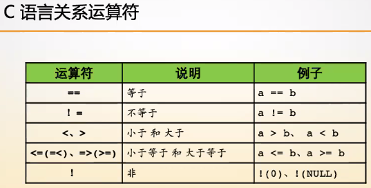

f(a) = !!(a)归一化表达式

ps：非0即为真

## (1)分支结构

### IF语句

```c
if (表达式) {
    代码段；
}
```

```c
if (表达式) {
    代码段1；
} else {
    代码段2；
}
```

```c
if (表达式) {
    代码段1；
} else if
```

#### 随堂练习１

程序读入一个正整数n，代表学生的成绩，根据分数输出档位

```c
#include <stdio.h>

int main() {
    int n;
    scanf("%d", &n);
    if (!n) {
        printf("FOOLISH\n");
    } else if (n < 60) {
        printf("FAIL\n");
    } else if (n < 75) {
        printf("MEDIUM\n");
    } else if (n <= 100) {
        printf("GOOD\n");
    }
    return 0;
}

```

#### 随堂练习２


### SWITCH语句

```c
switch (a) {
    case 1: 代码块1；
    case 2: 代码块2；
    case 3: 代码块3；
}
```


#### 随堂练习３

请使用switch结构完成如下任务，程序读入一个整数n

如果n = 1：输出 one

如果n = 2：输出 two

如果n = 3：输出 three

否则输出 error	

代码如下：

```c
#include <stdio.h>

int main() {
    int n;
    scanf("%d", &n);
    switch (n) {
        case 1:
            printf("one\n");
            break;
        case 2:
            printf("two\n");
            break;
        case 3: 
            printf("three\n");
            break;
        default:
            printf("error\n");
            break;
    }
return 0;
}

```

### 随堂练习三

请使用switch结构完成如下任务，程序读入一个整数n：

如果n = 1：输出 one two three 

如果n = 2：输出 two three

如果n = 3：输出 three

否则输出 error	

代码如下：

```c
#include <stdio.h>

int main() {
    int n;
    scanf("%d", &n);
    switch (n) {
        case 1:
            printf("one ");
        case 2:
            printf("two ");
        case 3: 
            printf("three\n");
            break;
        default:
            printf("error\n");
            break;
    }
return 0;
}

```


## (2)循环结构

### WHILE语句

```c
while (表达式) {        //每当表达式为真时，代码块就会被执行一次
    代码块;
}
```

```c
do {                   //每当代码段执行一次，就会判断一次表达式是否为真
    代码块;
} while (表达式);
```

####　随堂练习4

请使用WHILE循环实现程序，输出1---100；

代码如下：

```c
#include <stdio.h>

int main() {
    int n = 1;
    while (n <= 100) {
        printf("%d\n", n);
        n++;
    }
return 0;
}
```

```c
#include <stdio.h>

int main() {
    int n = 1；
    do {
        printf("%d\n", n);
        n++;
    } while (n <= 100);   
    return 0;
}
```


------


### FOR语句

```c
for (初始化; 循环条件; 执行后2操作) {
    代码块;
}
//Step1：初始化
//Step2：循环条件判断
//Step3：执行代码块
//Step4：执行后操作
//Step5：跳转到Step2
```


#### 随堂练习5

用for循环输出1----100；

```c
#include<stdio.h>
int main() {
    int i;
    for (i = 1; i <= 100; i++) {
        printf("%d\n", i);
    }
    return 0;
}
```


## 3.位运算

程序中的所有数在计算机内存中都是以二进制的形式储存的。位运算说就是直接对整数在内存中的二进制位进行操作。


|  <<按位左移　：  |    高位左移　低位补零    |
| :--------------: | :----------------------: |
| >> 按位右移　：  | 右移ｎ位　除以２的ｎ次方 |
|  ＆　按位与　：  |      全１才１否则０      |
| ｜    按位或　： |      有１就１否则０      |
| ^  按位亦或   ： |      不同为１否则０      |
|  ～按位取反　：  |     ０变１，　１变０     |


### &&与运算和||或运算的条件短路

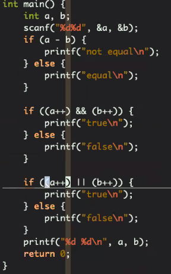


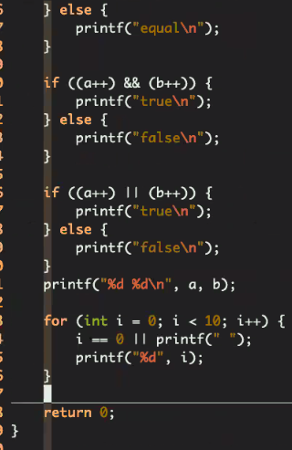

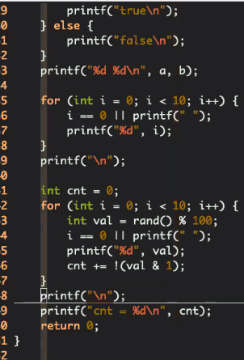


int val = rand() % 100;

val & (2^(i - 1)) = val % 2 ^ i


# 函数


### 普通代码和函数代码的区别

由函数封装的代码增强了代码的可读性


### 函数说明

```c
int is_prime(int x) {
    for (int i = 2; i <= x / 2; ++i) {
        if (x % i == 0) {
            return 0;
        }
    }                    //int 返回值
    return 1;            //is_prime 函数名
}                        //int x 参数声明列表
```

#### 随堂练习题1

请实现一个程序，先读入两个整数k, b，输出y = k * x + b直线方程中x = 1到x = 100时y的值。

```c
#include <stdio.h>

int f(int k, int b, int x) {
    return k * x + b;
}

int main() {
    int k, b;
    scanf("%d%d", &k, &b);
    for (int x = 1; x <= 100; x++) {
        printf("f(%d) = %d\n", x, f(k, b, x));
    }
    return 0;
}
```


------


# 递归程序

一、程序调用自身的编程技巧叫做[递归]

二、


#### 随堂练习题2

请实现一个程序， 读入n， 计算n的阶乘

```

```


# 函数指针


int *f1(int);与

int (*f1)(int);的区别


### 随堂练习一

**三角形数、五边形数和六角形数**

三角形数、五边形数和六角形数分别由以下公式给出：

|          |              |                     |
| :------- | :----------- | :------------------ |
| 三角形数 | Tn=n(n+1)/2  | 1, 3, 6, 10, 15, …  |
| 五边形数 | Pn=n(3n−1)/2 | 1, 5, 12, 22, 35, … |
| 六边形数 | Hn=n(2n−1)   | 1, 6, 15, 28, 45, … |

可以验证，T285 = P165 = H143 = 40755。

找出下一个同时是三角形数、五边形数和六角形数的数。

### 二分法查找

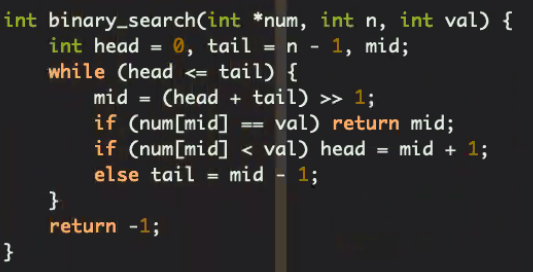

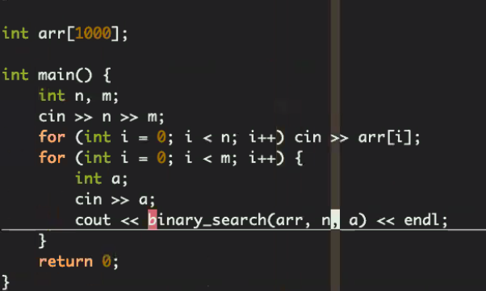

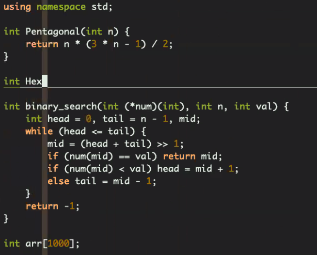

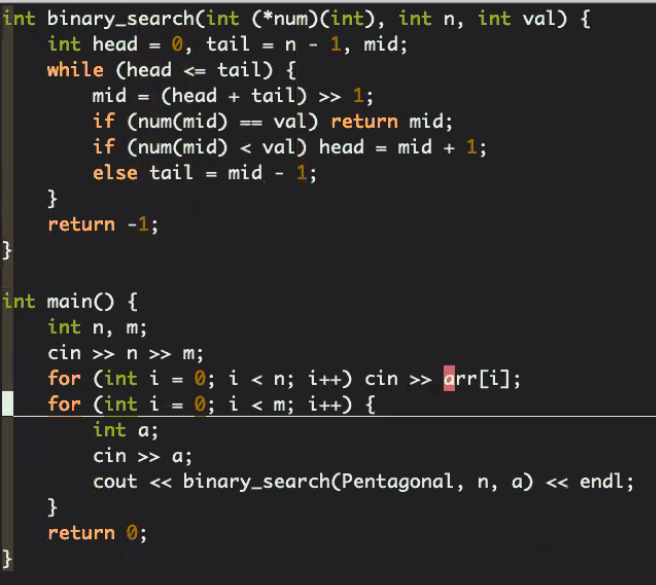


## ProjectEuler-45函数指针的应用

**函数是压缩的数组，数组是展开的函数。**

​                                                                                                                                                                                                                                                         

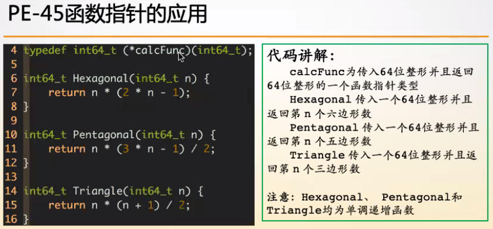

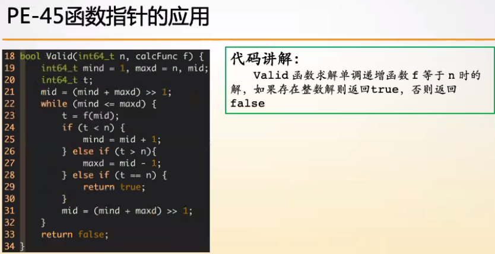


## ProjectEuler-05辗转相除


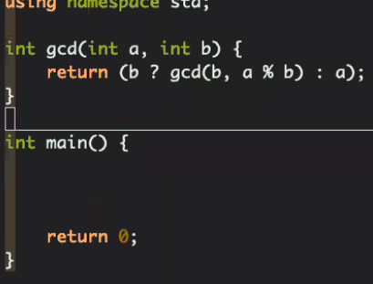


ax + by = 1          gcd(a, b) = d
a = nd
b = md
ndx + mdy = 1
d(nx + my) = 1  相当于d是1的一个因子

```c
#include <stdio.h>

int x, y;
int ex_gcd(int a, int b) {
    if (b == 0) {
        x = 1, y = 0;
        return a;
    }
    int r = ex_gcd(b, a % b), t = x;
    x = y;
    y = t - y * (a / b);
    return r;
}
int main() {
    int n, m;
    while (~scanf("%d%d", &n, &m)) {
        ex_gcd(n, m);
        printf("%d * %d + %d * %d = %d\n", n, x, m, y, n * x + m * y);
    }
    return 0;
}
```


```c
#include <stdio.h>

int ex_gcd(int a, int b, int *x, int *y) {
    if (b == 0) {
        *x = 1, *y = 0;
        return a;
    }
    int r = ex_gcd(b, a % b, y, x);
    *y = *y - *x * (a / b);
    return r;
}
int main() {
    int n, m, x, y;
    while (~scanf("%d%d", &n, &m)) {
        ex_gcd(n, m, &x, &y);
        printf("%d * %d + %d * %d = %d\n", n, x, m, y, n * x + m * y);
    }
    return 0;
}
```


## 变参函数


**实现可变参数max_int, 从若干个传入的参数中返回最大值。**

**int max_int(int a, ...);**

**如何获得 a 往后的参数列表？  --------   va_list 类型的变量**

**如何定位 a 后面的第一个参数的位置？ ----- va_start 函数** 

**如何获取下一个可变参数列表中的参数？---- va_arg 函数**

**如何结束整个获取可变参数列表的动作？---- va_end 函数**


```c
#include <stdio.h>
#include <stdarg.h>

int max_int(int num, ...) {
    int ans = 0, temp;
    va_list arg;
    va_start(arg, num);
    while (num--) {
        temp = va_arg(arg, int);
        if (temp > ans) ans = temp;
    }
    va_end(arg);
    return ans;
}
int main() {
    printf("%d\n", max_int(3, 1, 5, 3));
    printf("%d\n", max_int(2, 1, 3));
    printf("%d\n", max_int(6, 6, 5, 3, 7, 9, 10));
    printf("%d\n", max_int(3, 1, 9, 10));
    return 0;
}
```

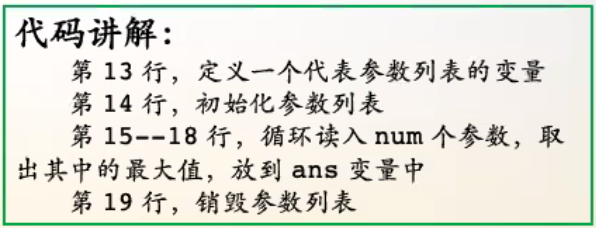


```

```

