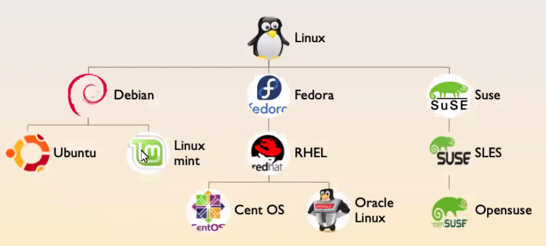
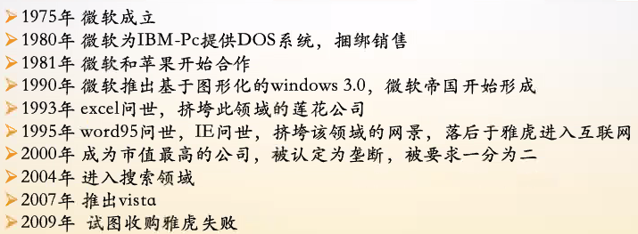
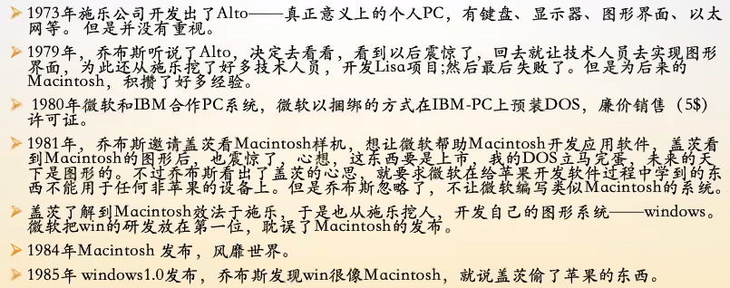
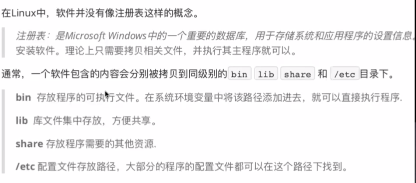
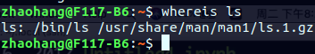

# Linux操作系统(宿船长)笔记

[TOC]

## Terminal普通用户和管理员用户的切换

### 管理员用户切换到普通用户

1.在管理员用户下输入命令“exit”；退出管理员用户

2.命令“logout”

3.命令“su - (普通用户名)”-------例：su - zhaohang

4.命令“ctrl + d”

### 普通用户切换到管理员用户

su - root(普通用户直接切换管理员用户，输入管理员密码)

sudo -i（普通用户切换到临时管理员用户，输入普通用户密码）

## 输入命令时遇到权限被拒绝（Permission Dinied）

## 初期常见原因：

------

1）没有可执行权限

2）文件或目录为管理员用户下的

***解决方法：输入命令"sudo !!"***(代表本人为管理员，可获得上一命令的临时管理员权限)

## “echo $？”命令

------查看命令是否成功执行-----

返回值0为成功----返回值1为失败

## "fatal"致命错误

## github

git remote -v查看当前是否建立远程连接

git push origin master

git remote add origin git@github.com:a751213964/库名.git

cd - 

## 安装软件

apt-get install nmon

"apt-get"相当于一个软件管理器

apt-get update

apt-get upgrade

apt-get install a

apt-get --purge remove a(保留用户配置信息及用户数据并卸载)

apt-cache search + 关键字(查找)

sudo apt-get autoremove()

sudo apt-get install -f()

## 远程复制隐藏文件

1. 以“ . ”开头的文件是被隐藏的，如“.a.tmp”;

2. 查看隐藏文件要用"ls -al"或“ls -al ."

   注：以上命令为"ls -a -l +参数"；

3. 远程复制命令格式为

   “scp+路径+远程主机：文件名+新建文件名”

   注：远程主机为用户名、域名以及IP地址

   例如**“scp**

   scp zhaohang@pi19:./.a.tmp

   scp zhaohang@pi19:/home/zhaohang/.a.tmp ~/a.tmp

4. "echo $PATH"命令可以到所有的bin目录下查找文件

## 操作系统的产生

概念产生>>

### UNIX的出现

Multics >> Unics >> Unix

### LINUX的兴起

**AT&回收版权  >>  谭邦宁教授开发minix  >>  Linus开发Linux**

### LINUX的主要应用

大型机

小型机

中低端服务器

手机

电视盒子

其他几乎所有的嵌入式设备

### 微软的发展

### 苹果的发展

### 微软与苹果

shell是一种人机交互的接口，shell有壳的意思，是指“提供使用者使用界面”的软件，是一种命令解释器。

windows的cmd就是一种shell

## 命令中使用“-”和"--"的区别

ls -al ("-"的后面接命令简写)

ls --all("-"的后面接命令全称)

ls是一个帮助手册软件(man手册)

## 远程路径

远程路径默认的协议为: 

## 软件

我们经常会执行"ls"这个命令,实际上"ls"是一个帮助手册(man手册), 比如我们在终端中输入命令"whereis ls", 会显示ls文件的路径:

这样我们会看到  ls.1.gz

在LINUX中,通常是没有像注册表这样的概念

通常，一个软件包含的内容会分别被拷贝到同级别的bin、lib、share和/etc目录下

bin :存放程序的可执行文件, 在系统环境变量中将该路径添加进去，就可以直接执行程序。

lib :库文件集中存放,，方便共享。

share ：存放程序需要的其他资源

/etc：配置文件存放路径，大部分的程序的配置文件都可以在这个路径下被找到。如vimrc。

## 文件类型

## 显示别名命令：alias

